# RELATÓRIO DE ANÁLISE - VENDAS DE VIDEOJOGOS

**PERGUNTA DE NEGÓCIO:** Quais géneros e plataformas geram mais vendas por região e como evoluiu o mercado ao longo do tempo?

**USER STORIES A ANALISAR:**

1. Como publisher de videojogos, quero ver quais géneros geraram mais vendas globais por década para decidir em que tipo de jogos investir na próxima geração.

2. Como analista de mercado, quero ver como a quota de mercado das plataformas evoluiu ao longo das décadas para identificar ciclos de dominância e antecipar tendências de hardware.

3. Como retalhista de videojogos, quero ver quais géneros vendem melhor em cada região geográfica (NA, EU, JP) para ajustar o stock e as campanhas de marketing por mercado.

# ANÁLISE GERAL

- Unidades vendidas globalmente: **~8973.63 Milhões** em 4 décadas;
- Videojogos lançados: **11246**
- Publicadoras: **~575**
- Plataformas: **31**, agrupadas por **Manufacturer**

# GENRES

Atualmente, o genre **Action** domina o mercado global, seguido de **Sports**, **Shooter**, **Role-Playing** e **Platform**.

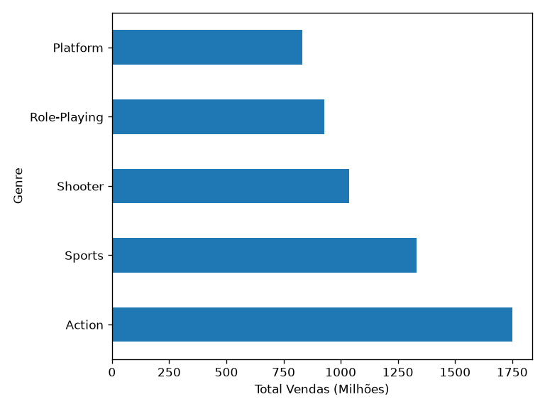

Historicamente, não foi sempre o genre mais dominante.

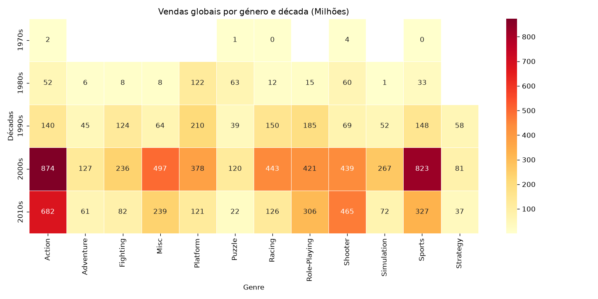

**LEITURA:** Durante as primeiras décadas do mercado de videojogos, o genre mais dominante foi o **Platform**, com **Action** tendo um crescimento exponencial a partir da década de 2000, mantendo essa dominância durante a década de 2010, acompanhado pelo crescimento de genres como **Shooter**, **Sports** e **Role-Playing**.

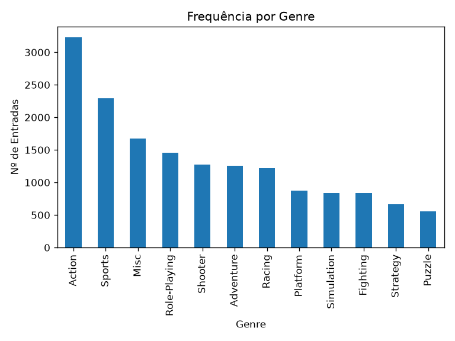

**LEITURA:** O genre de jogo mais lançado é **Action**, seguido de **Sports**, o que também contribui para a popularidade e quantidade de vendas de ambos (mais lançamentos = mais unidades vendidas).

# MANUFACTURERS

Para facilidade de análise, as plataformas listadas foram agrupadas por Manufacturer. Para efeitos de análise, uma "entrada" significa um videojogo, a nível de título (o mesmo título pode ter várias unidades).

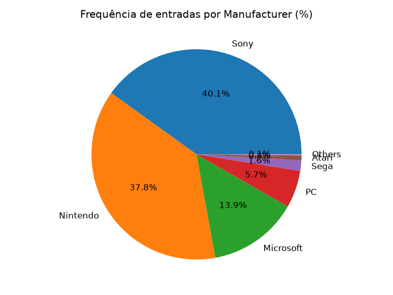

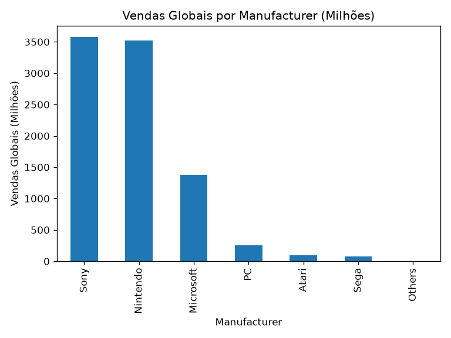

**LEITURA:** Verifica-se uma luta renhida em termos de popularidade entre a Nintendo e a Sony, com a Microsoft como terceira mais popular. São as 3 grandes manufacturers que desenvolvem plataformas para o lançamento de novos videojogos, e são também as que recebem mais entradas diferentes.

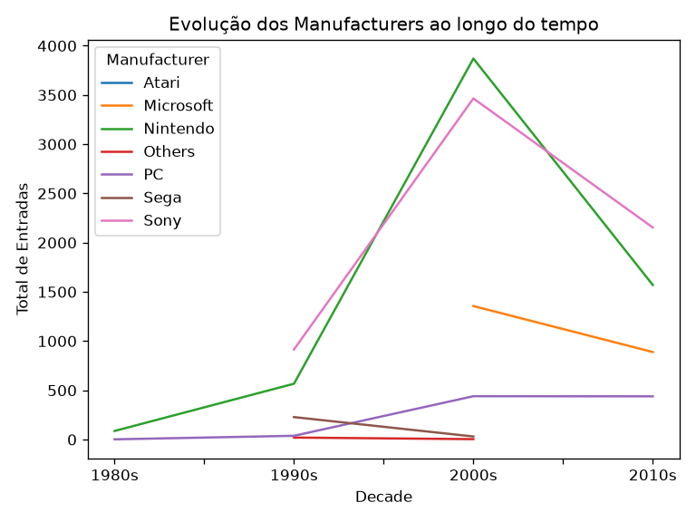

**LEITURA:** Existe um pico na década de 2000 em unidades vendidas para consolas da Nintendo e da Sony, assim como o aparecimento das consolas Microsoft. Outras manufacturers apareceram, mas não tiveram o mesmo sucesso e acabaram por ser descontinuadas, como se verifica pelo tamanho das linhas. Outra linha que demonstra um crescimento gradual é a de PC.

# REGIÕES

As 3 grandes regiões do mercado de videojogos são: NA (North America), EU (Europe) e JP (Japão). Foram também estudadas as estatísticas de outras regiões menores, agrupadas na classe "Others". Todas estas regiões apresentam estatísticas diferentes para cada métrica relevante para esta análise. Foi feito um estudo relativamente às vendas de cada região, as vendas de cada genre por região, as vendas de cada videojogo por região (agrupados num top 5 para facilidade de análise).

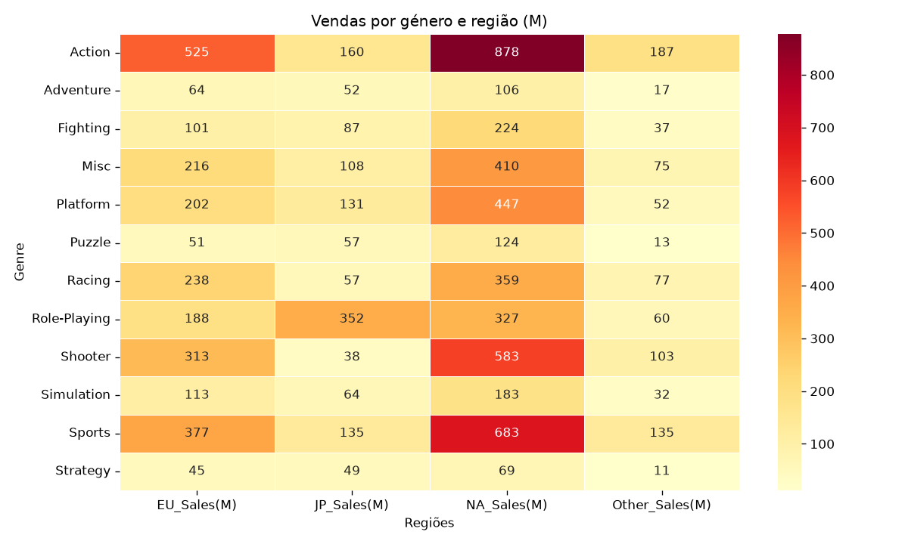

**LEITURA:** Relativamente aos mercados regionais (NA, EU, JP, Others), **Action** domina os mercados da América do Norte, Europa e outras regiões, enquanto que **Role-Playing** domina o mercado japonês.

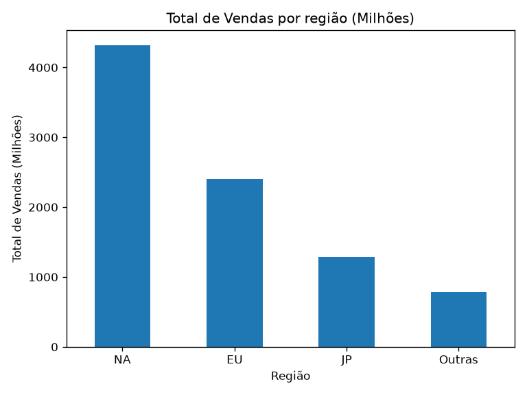

**LEITURA:** O mercado com mais unidades vendidas é o mercado NA (onde nasceram os videojogos), seguido do mercado europeu e japonês.

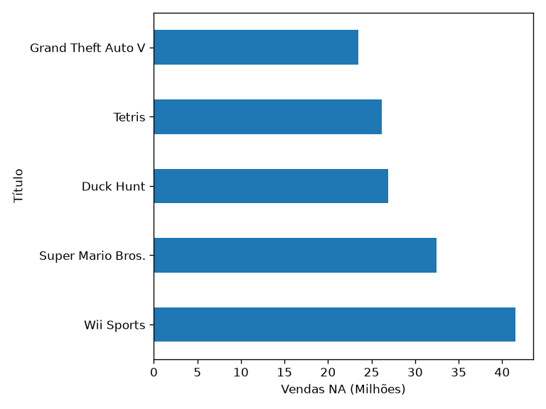

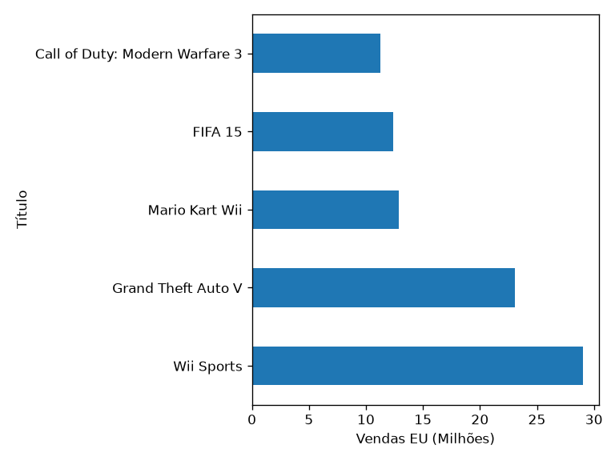

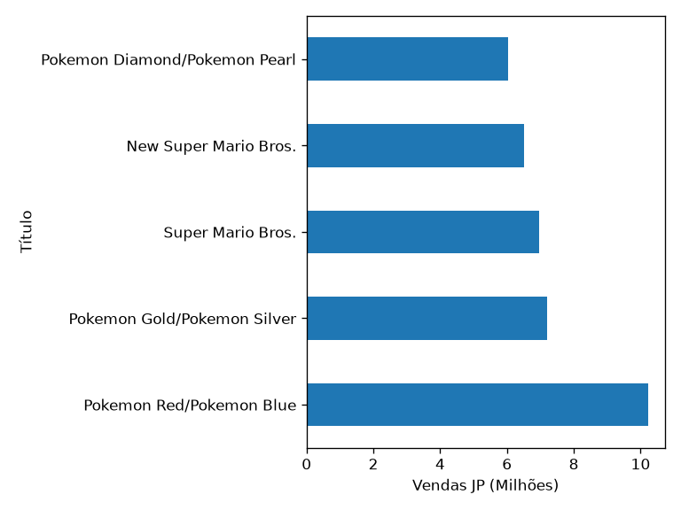

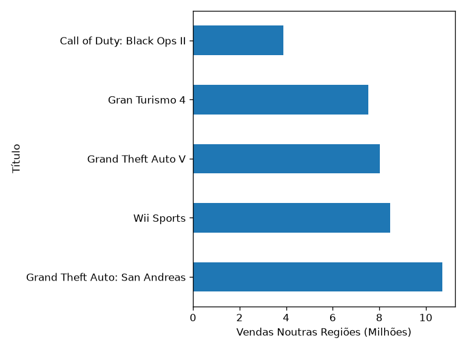

**LEITURA:** É possível verificar uma drástica diferença entre os mercados ocidentais e o mercado japonês, a nível de títulos, suportado pela diferença de popularidade de genres vista no gráfico anterior.

# REPOSTAS

1. Inicialmente, os genres que geraram mais vendas foram **Platform**, sendo que a partir da década de 2000, o genre **Action** teve um crescimento exponencial, sendo o mais popular atualmente, seguido de **Shooter** e **Sports**. São bons genres em que apostar na próxima geração.

2. O mercado de plataformas é largamente dominado pela **Nintendo** e pela **Sony**, e essa dominância não parece acabar tão cedo. É seguro acreditar que continuarão a ser as benchmarks a superar em termos de hardware de consola.

3. Em relação aos mercados regionais, o genre mais dominante em todos é **Action**, exceto no mercado japonês, onde **Role-Playing** é o genre mais dominante.